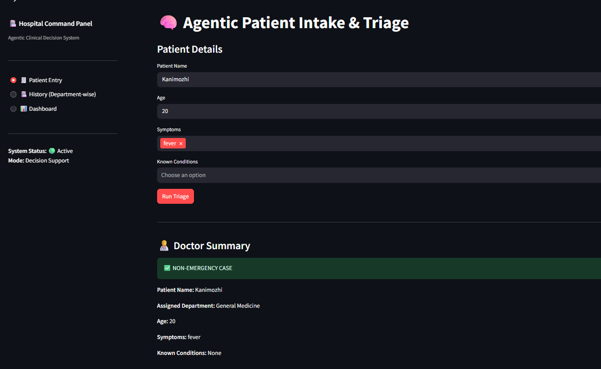
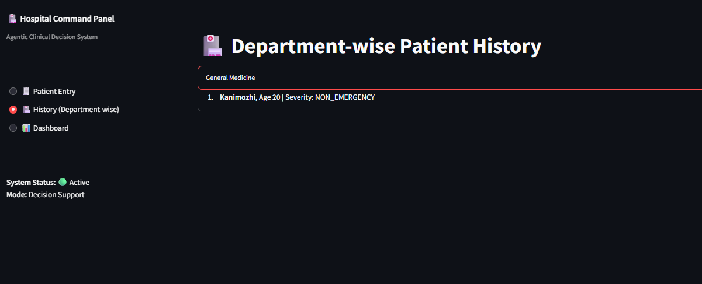
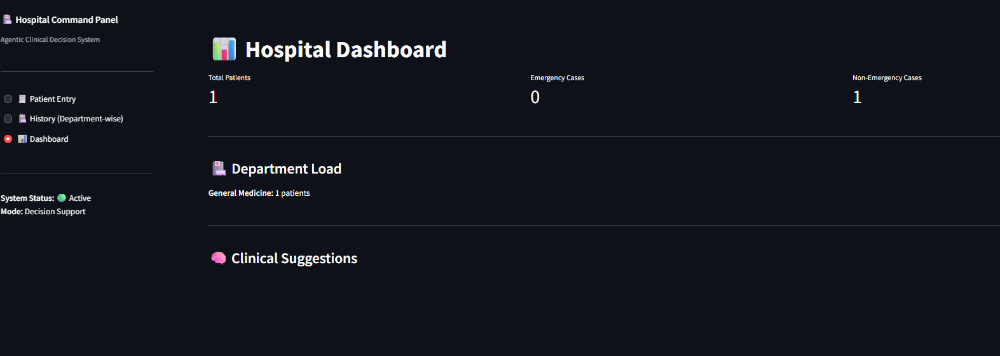

# Agentic Patient Triage System

[](https://agentic-patient-triage.streamlit.app/)


## Live Demo

Access the live app here: [Open Live App](https://agentic-patient-triage.streamlit.app/)

## Project Overview

The Agentic Patient Triage System is an intelligent clinical decision support system designed to assist hospitals in managing patient intake, triage, and routing efficiently. It leverages agent-based automation to assess patient severity, assign appropriate departments, and provide summaries for doctors, improving decision-making speed and accuracy.

## Problem Statement

In busy hospital settings, patient management can be challenging due to:

* High patient volumes causing delays in triage.
* Difficulty in identifying emergency cases promptly.
* Inefficient routing to the correct department.
* Lack of structured summaries for quick clinical review.

These challenges can lead to delays in care, misallocation of resources, and increased risk for patients with critical conditions.

## Solution

The system automates patient intake and triage using agent-based intelligence:

1. **Patient Intake Agent**: Collects patient information including age, symptoms, and known conditions.
2. **Triage Agent**: Evaluates patient severity to identify emergency cases.
3. **Routing Agent**: Assigns patients to the appropriate department based on symptoms and conditions.
4. **Summary Agent**: Generates a concise summary for doctors including severity, department assignment, and patient details.

This workflow ensures that patients are prioritized correctly, departments are informed about patient load, and doctors have immediate access to relevant information.

## System Workflow

```
Patient Entry → Intake Agent → Triage Agent → Routing Agent → Summary Agent → Dashboard / History
```

## Key Features

* Intelligent triage: Automated severity assessment to flag emergency patients.
* Department assignment: Routes patients to the correct clinical department.
* History tracking: Maintains department-wise patient history with clear categorization of general and emergency cases.
* Dashboard: Provides real-time metrics on total patients, emergency load, and department-specific statistics.
* Seamless interface: Clean UI for easy navigation between patient entry, history, and dashboard.

## Screenshots

**Patient Entry Screen**


**Department-wise History**


**Dashboard View**


## How to Run

1. Clone the repository:

```bash
git clone https://github.com/its-kanii/agentic-patient-triage.git
```

2. Navigate to the project directory:

```bash
cd agentic-patient-triage
```

3. Install dependencies (Streamlit and other required packages):

```bash
pip install streamlit
```

4. Run the Streamlit app:

```bash
streamlit run app.py
```

5. Open the displayed URL in your browser to access the system.

## Folder Structure

```
agentic-patient-triage/
│
├─ app.py                    # Main Streamlit application
├─ README.md                 # Project documentation (problem, solution, workflow)
│
├─ agents/                   # All agent modules
│   ├─ __init__.py           # Makes 'agents' a Python package
│   ├─ intake_agent.py       # Handles patient intake
│   ├─ triage_agent.py       # Determines patient severity (emergency/non-emergency)
│   ├─ routing_agent.py      # Assigns patients to appropriate departments
│   └─ summary_agent.py      # Generates doctor summaries and reports
│
├─ utils/                    # Utility modules used by agents and app
│   ├─ __init__.py
│   └─ event_bus.py          # Event bus for communication between agents
│
├─ medical_data/             # JSON files for system rules and medical data
│   ├─ symptoms.json         # List of possible symptoms
│   ├─ conditions.json       # List of known medical conditions
│   └─ risk_rules.json       # Rules for severity and risk assessment
│
└─ .gitignore                # Files/folders to ignore in Git (e.g., __pycache__, .env)
```

